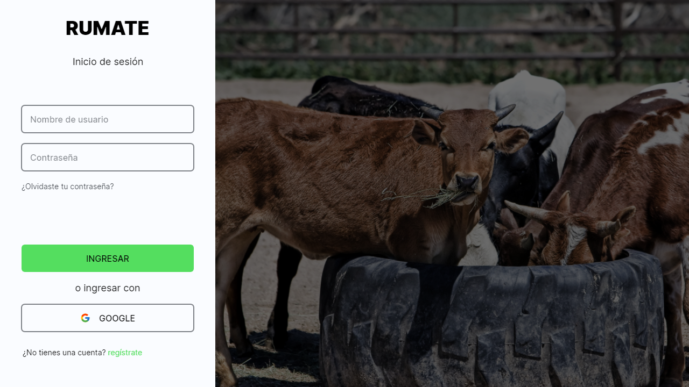

# RuMate

Un software dedicado al remate rural, también conocido como “software de subastas ganaderas, rurales y otros”, es una herramienta especializada, diseñada para gestionar y facilitar el proceso de remate y subastas, tanto de ganado como de otros bienes inherentes al rubro.

## Autores

- [@Leandro Olivera](https://github.com/lew5)
- [@Gabriel Ececheste](https://github.com/lew5)
- [@Joaquín Ojeda](https://github.com/lew5)
- [@Aron Camargo](https://github.com/lew5)

## Utilizado por

Este proyecto es utilizado por las siguientes empresas:

- Company 1
- Company 2

## Screenshots

